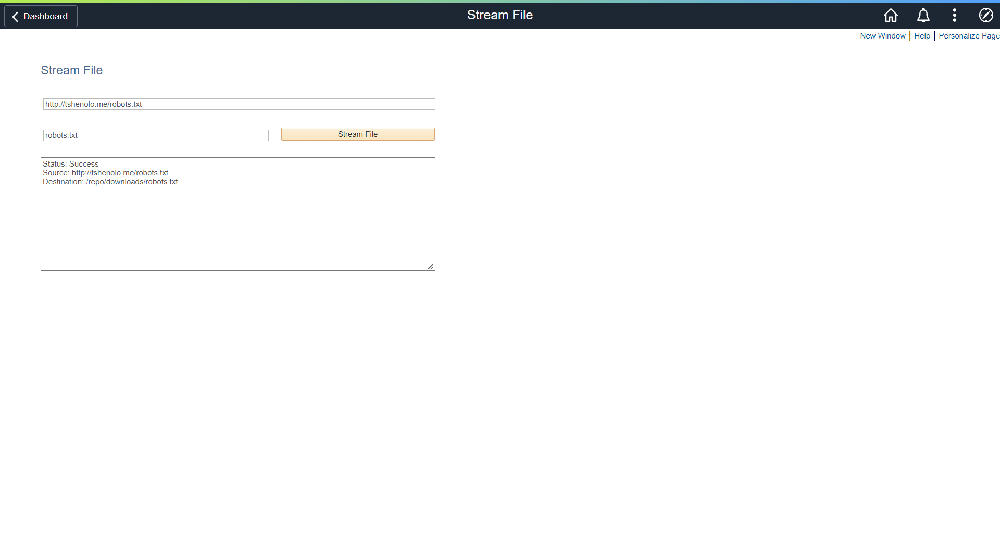

# PeopleSoft File Stream
PeopleSoft utility to stream files directly to the PeopleSoft file system.



## How to Install
### Step 1: Import the custom menu and folder
1. Launch Application Designer 
2. click Tools, Copy Project, From File...   
3. click Select, choose MXM_CUSTOM_INIT
4. click Copy

### Step 2: Import the project
1. Launch Application Designer
2. Click Tools, Copy Project, From File...   
3. Click Select, choose MXM_FILE_STRM
4. Click Copy

### Step 3. Build Project 
Note: Perform this step if the project contains SQL Tables otherwise skip it
1.	Click Build, Project...
2.	Check the following options:  
    a.	Create Table  
    b.	Create Indexes  
    c.	Create Views  
    d.	Execute and build script.  
3.	Click Build

### Step 4. Register the component
1. Open the component
2. Click Tools, Register Component...
3. Check off the following:
   - Add this component to a menu
   - Add this component to a portal registry
   - Add this component to a permission list
4. Click Next
5. Select Menu Name: MXM_CUSTOM_MENU and Bar Name: USE
6. Click Next
7. Select Folder Name: MXM_CUSTOM
8. Change Content Reference Label and Long Description fields to "Stream File"
9. Check off Always use default local node
10. Click Next
11. Select Permission List Name: PTPT1200
12. Click Next
13. Check off Registry entry under Add to project
14. Click Finish

## Technical Documentation
### App Designer Project: MXM_FILE_STRM

### URLs
URL Identifier: MXM_DOWNLOADS  
Description: File Downloads   
URLID: /repo/downloads/   


### Records					
Record: MXM_FILE_STRM
Type: Derived/Work
| Field | Type | Length | Long Descr | Short Descr |
| ------| --------- | --------- | --------- | --------- |
| URL | Char | 254 | URLID | URL |            
| FILENAME | Char | 80 | File Name | File Name |     
| SUBMIT_BTN | Char | 1 | Submit Button | Submit |         
| DESCRLONG | Long | 0 | Description | Descr | 


### PeopleCode
Event: MXM_FILE_STRM.PageActivate
```
MXM_FILE_STRM.URL.HtmlAttributes = "placeholder=""http://www.example.com/filename.txt""";
MXM_FILE_STRM.FILENAME.HtmlAttributes = "placeholder=""filename.txt""";
```

Event: MXM_FILE_STRM.URL.FieldEdit

```
If All(MXM_FILE_STRM.URL.Value) Then;
   Local string &sURL = MXM_FILE_STRM.URL.Value;
   Local array of string &SUBPARTS = Split(&sURL, "/");
   MXM_FILE_STRM.FILENAME.Value = &SUBPARTS [&SUBPARTS.Len];
End-If;
```

Event: MXM_FILE_STRM.SUBMIT_BTN FieldChange

```
/*
import org.apache.commons.io.FileUtils;
import java.io.File;
import java.io.IOException;
import java.net.URL;
FileUtils.copyURLToFile(url, new File(fileName));
*/

Local string &CRLF = Char(13) | Char(10);

try
   
   If All(MXM_FILE_STRM.URL.Value, MXM_FILE_STRM.FILENAME.Value) Then
      Local string &sFilePath = GetURL(URL.MXM_DOWNLOADS) | MXM_FILE_STRM.FILENAME.Value;
      Local JavaObject &jUrl = CreateJavaObject("java.net.URL", MXM_FILE_STRM.URL.Value);
      Local JavaObject &jFile = CreateJavaObject("java.io.File", &sFilePath);
      Local JavaObject &jFileUtils = GetJavaClass("org.apache.commons.io.FileUtils");
      &jFileUtils.copyURLToFile(&jUrl, &jFile);
      MXM_FILE_STRM.DESCRLONG.Value = "Status: Success" | &CRLF | "Source: " | MXM_FILE_STRM.URL.Value | &CRLF | "Destination: " | &sFilePath;
      
   Else
      MXM_FILE_STRM.DESCRLONG.Value = "All fields are required";
   End-If;
   
catch Exception &Err
   MXM_FILE_STRM.DESCRLONG.Value = "Exception: " | &Err.ToString();
   &Err.Output();
end-try;
```

### Pages      
Page: MXM_FILE_STRM         
Title: Stream File   
MXM_FILE_STRM.URL      
MXM_FILE_STRM.FILENAME   
MXM_FILE_STRM.SUBMIT_BTN   
MXM_FILE_STRM.DESCRLONG 

### Component

| Component | MXM_FILE_STRM | 
| ------| --------- |
| Page | MXM_FILE_STRM | 
| Navigation | Custom Components > Stream File | 
| Item Label | Stream File | 
| Search Record | INSTALLATION |
| Add | Selected | 
| Update Display | Selected |
| Disable Saving Page | Selected | 
| Menu | MXM_CUSTOM_MENU |
| Bar item Name | MENUITEM | 
| Portal | Employee |
| Folder Name | MXM_CUSTOM | 
| Content Reference label | Stream File |
| Long Description |Stream File | 
| Sequence Number | 0 |
| Always Use Local Node | Selected | 
| Permission Lists | PTPT1200 |
| Actions | Add, Update/Display |


## Feedback:
Please create a GitHub Issue for any bugs, feature requests, etc. Happy to accept pull requests too!
